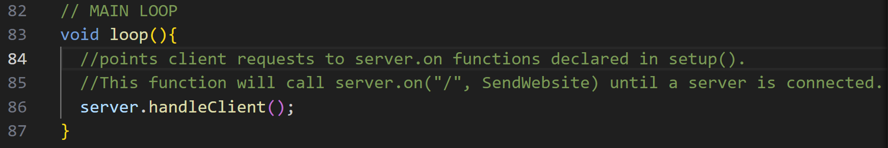
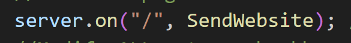

### ESP32 for SDSM&T biomedical engeneering microfluidic project.
This git is for creating the GUI for the sdsmt BioMed Microfluidics Pump controller. The GUI is designed to run 7 motors at the same time with varing rotational velocities.

The bulk of the c++, html, and js code for this project is within the src folder.

## Environment
I am using VScode with the platformIO extention.
I am using an esp32 to set up my webserver

I use the following Libraryies:
    #include <WiFi.h> // for setting up the wifi connections
    #include <WebServer.h> // for setting up the server and message control

## Logic
The Charzard.h creates a char array named PAGE_MAIN[]. This variable is used to store HTML and JavaScript code for serving a web page. When the page is loaded in your browser, a '/' is sent back which is it's root path.
Example of my current gui path:
    http://172.20.10.7/

The foward slash is caught by the handleClient() in the main loop(). The client handler compare the root path with the parameters within the setup() section.

.. To be continued