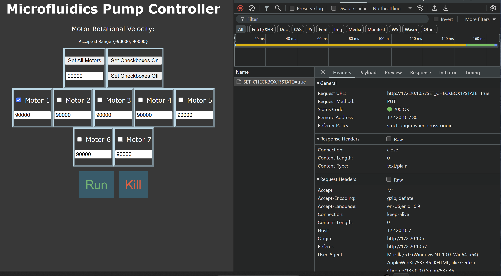

# ESP32 for SDSM&T biomedical engeneering microfluidic project.
This git is for creating the GUI for the sdsmt BioMed Microfluidics Pump controller. The GUI is designed to run 7 motors at the same time with varing rotational velocities.
 
The bulk of the c++, html, and js code for this project is within the src folder.

## Environment
I am using VScode with the platformIO extention.
I am using an esp32 to set up my webserver

I use the following Libraryies:
    #include <WiFi.h> // for setting up the wifi connections
    #include <WebServer.h> // for setting up the server and message control

## Logic
The Charzard.h creates a char array named PAGE_MAIN[]. This variable is used to stores HTML and JavaScript code for serving a web page. When the page is loaded in your browser, a '/' is sent back which is it's root path.
Example of my current gui path:
    

The foward slash is caught by the handleClient() in the main loop().

The client handler compares the client root path with the first parameters within the setup() section using the .on method.

The .on method will execute the function in the second parameter if the first parameter matches the request. (in this case '/')
Here is the function that is called:

This code will send the current html string to the client. *In other words, display the GUI.

Within the HTML code, The buttons or numboxes have an onchange or onclick attribute associated with it.
Example:

These onchange or onclick events calls a js function declared below the HTML section.
Example Continuted:

This JS code saves the checkbox for the HTML section. It also sends the state of the checkbox to the main c file to keep track of it's state.

Here's how it works: xhttp.open("PUT", "SET_CHECKBOX1?STATE="+checkState, false);
    The client assembles a PUT request containing the path /"SET_CHECKBOX1?STATE="+checkState
    
    checkState is appended and is either "true" or "false" depending if the checkbox is on or off.

The client handler catches the PUT request and compares the path to the first parameters.
    xhttp PUT request contains "SET_CHECKBOX1".

The .on method then calls checkBox1Toggle()

I use the server.arg method to pull the STATE of the checkbox and store it in my main c++ file. I do this to keep track of my html changes inorder to prepare them for a function that my lab partner wrote.
Note: STATE is a variable defined in the put request and has to match.

All functions that are called by the server.on method needs to send the server(200, "anything", ""); You can use this to send messages back to the client but in my case I didn't.